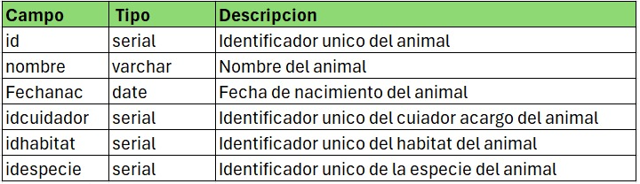
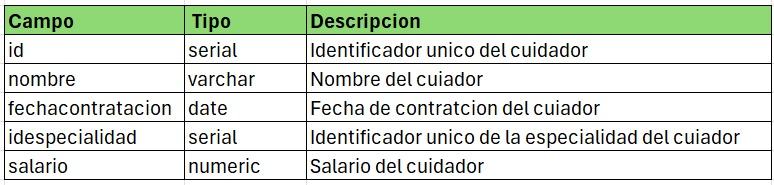
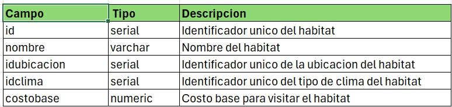
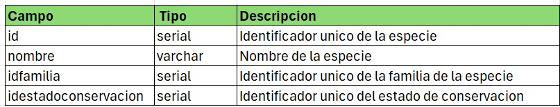

# Vida_Silvestre_DB

# 🚀 Vida Silvestre - Sistema CRUD para Zoológicos

**Desarrolladores**: Erwin jaime, Tatiana Nieto, Alexis Castellanos, Leyder Jaimes
**Directorio Fuente**: \src\Byte_Builders\Vida_Silvestre_DB 📂  
**Creado**: 10-Diciembre-2024 🗓️  
**Última Actualización**: 10-Diciembre-2024 ✨

## Descripción

Bienvenido a **Nuestro Proyecto**! Este repositorio alberga un sistema web diseñado para gestionar de manera eficiente la información sobre los animales de un zoológico. Este software permite realizar las operaciones básicas de CRUD (Crear, Leer, Actualizar y Eliminar) en una tabla de una base de datos, asegurando un manejo sencillo e intuitivo de los datos.

## Especificaciones Técnicas

## Tecnologías Utilizadas
- Backend: FastAPI
- Frontend: React.js
- Base de Datos: PostgreSQL
- Lenguajes: Python, JavaScript

## Estructura de la Base de Datos

La base de datos incluye una tabla principal llamada **animales,** con los siguientes campos:
## Tabla: animales 🦊

## Relaciones

## 1. animales -> cuidador
un cuiador tiene a cargo muchos animales y un animal tiene un cuiador
**uno a muchos**
## 2. animales -> habitat
un animal vive en un habitat y un habitat tiene muchos animales
**uno a muchos**
## 3. animales -> especie
un animal pertenece a una especie y a una especie pertenecen muchos animales
**uno a muchos**

## Tabla: cuidador 👮🏼

## Tabla habitat 🌳

## Tabla especie 🐨

## Instrucciones para manejar el sistema 📚

para mas información sobre el manejo del sistema y lo necesario para su correcto funcionamiento pueden revisar la carpeta llamada manuales en la parte superior izquierda del repositorio donde encontraras una guia detallada sobre como manejar el sistema de todas las maneras. 😃
 

